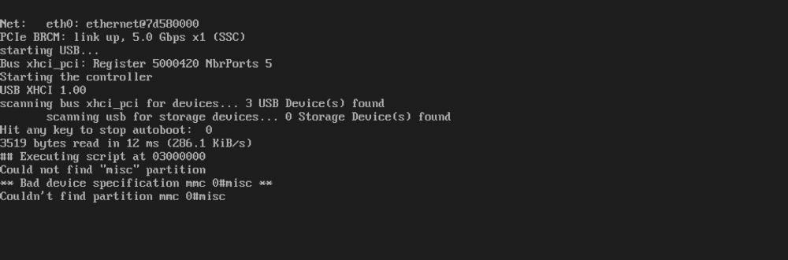
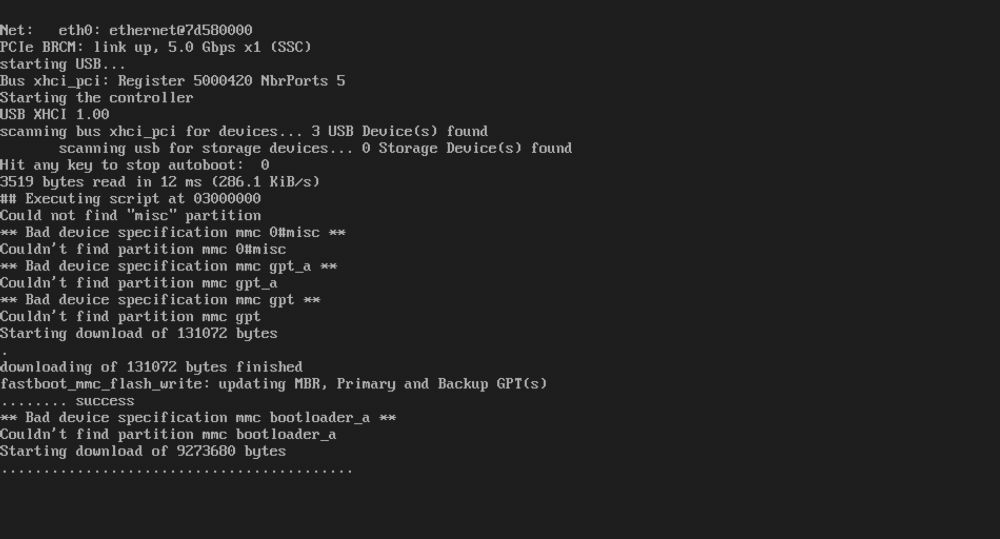
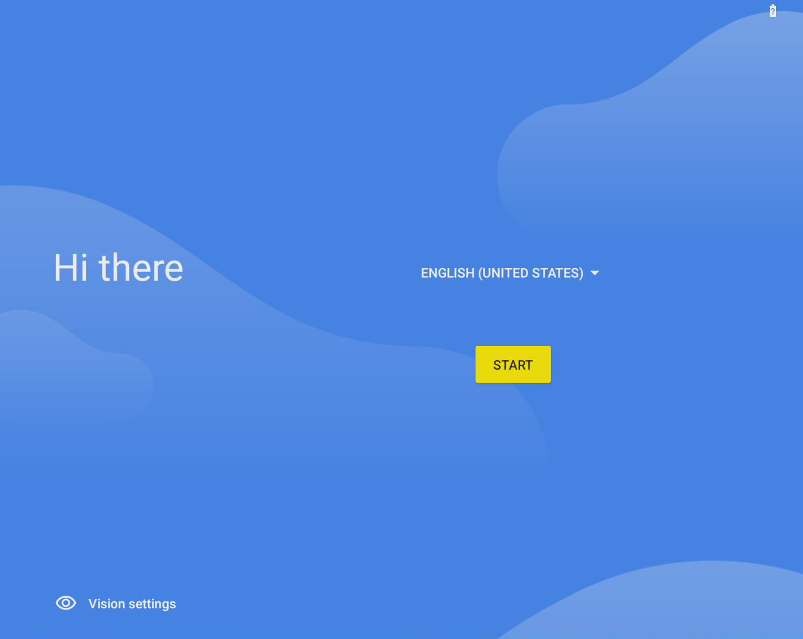
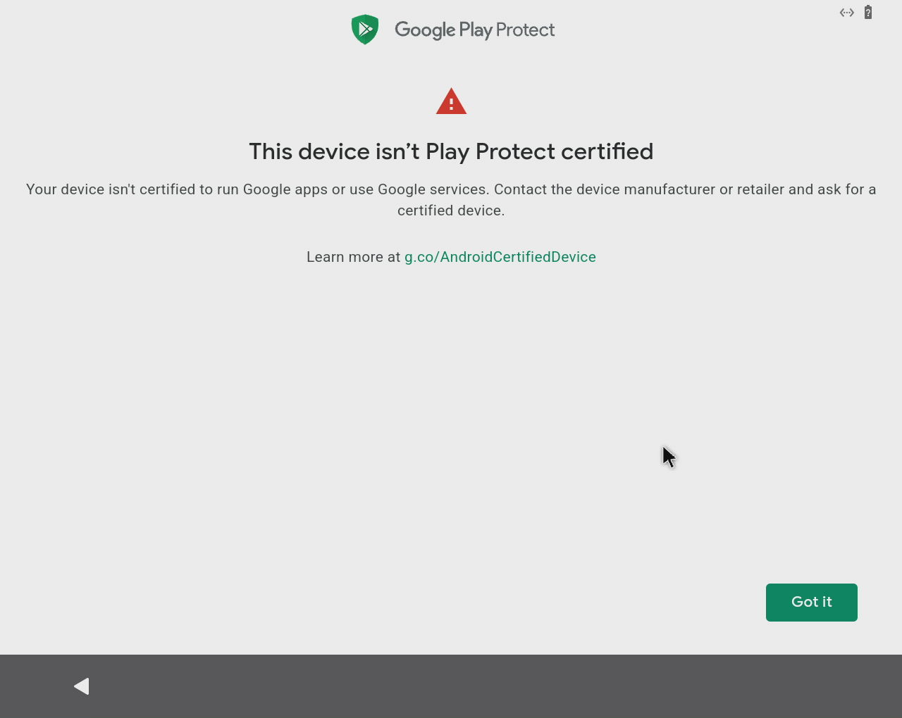
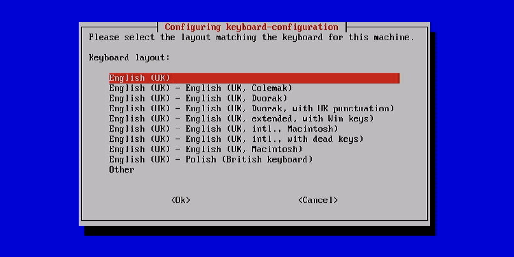
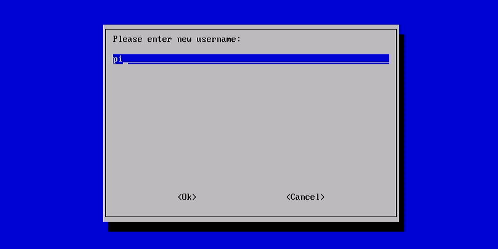
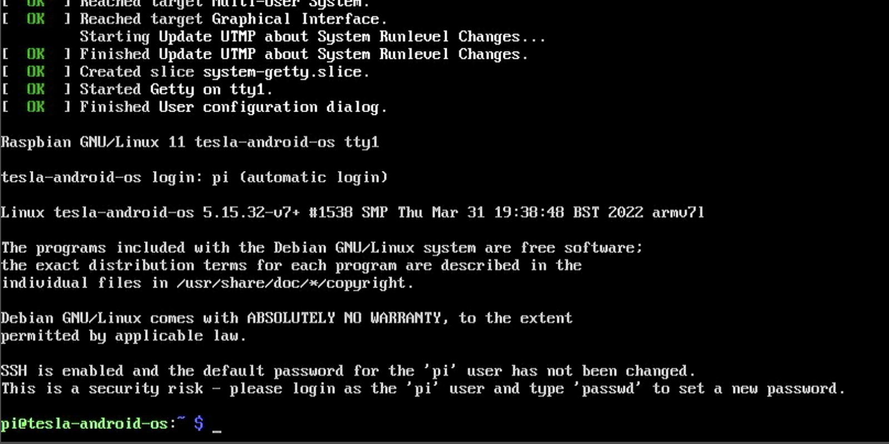

## Install guide (2022.18.1)

In the first few releases two Raspberry Pi boards will be used. This configuration allows easier development and testing of new features. This solution is temporary and will be replaced with a single Raspberry Pi 4 based solution. 

The install guide is divided into two main parts - installing a custom build of Android and exposing it to the Tesla touchscreen using Raspbian (Linux).

### Android

1. Begin by downloading the newest build of Tesla Android from GitHub - [tesla-android-2022.18.1.zip](https://github.com/tesla-android/android-manifest/releases/download/2022.18.1/tesla-android-2022.18.1.zip)
2. Make sure that both fastboot and adb is installed and accessible from your terminal. Make sure to use a recent version from [https://developer.android.com/studio/releases/platform-tools](https://developer.android.com/studio/releases/platform-tools) if you stumble upon any issues with flashing.
3. Using Balena Etcher or Raspberry Pi Imager flash an image named: "deploy-sd.img" to your SD Card.
4. Insert the SD Card into your Raspberry Pi 4, connect a USB mouse as well as a display using HDMI.
5. Connect the Pi to your computer using a USB-C to USB-A/USB-C cable. You should see a bootloader on your display:

6. Verify that your computer has detected the Pi by typing: "fastboot devices". Example of a correct output:

7. Navigate to a folder that contains an extracted archive with Tesla Android.
8. Execute commands one by one to install Android:
    ```bash
    fastboot flash gpt deploy-gpt.img
    fastboot flash bootloader bootloader-sd.img
    fastboot flash uboot-env  env.img
    fastboot reboot

    # Wait for board to power up in bootloader

    fastboot oem format
    fastboot flash bootloader      bootloader-sd.img
    fastboot flash uboot-env       env.img
    fastboot flash recovery_boot   boot.img
    fastboot flash dtbo_a          boot_dtbo.img
    fastboot erase misc
    fastboot reboot-fastboot

    # Wait for board to power up in fastboot

    fastboot flash boot   boot.img
    fastboot flash super  super.img
    fastboot format:ext4 userdata
    fastboot format:ext4 metadata
    fastboot reboot
    ```
If you are using Windows, to make fastboot find your device you need the Android USB Driver, download it from:  [https://developer.android.com/studio/run/win-usb](https://developer.android.com/studio/run/win-usb)
After you plug your Raspberry Pi on your computers USB port, it will be shown as "USB download gadget" on the Windows Device Manager and the command "fastboot devices" won't find anything.
On the Windows Device Manager, right-click the name of the device ("USB download gadget"), and then select Update Driver Software. In the Hardware Update wizard, select Browse my computer for driver software and click Next. Click Browse and then locate the USB driver folder you just downloaded.
Fastboot should be able to find your Raspberry Pi now.

9. Grab yourself something to drink, it will take a while. You should see progress on the screen while the script is executing:

10. The Pi will reboot a few times before the setup is finished. The screen will be black for some time after the script is done executing. After that you should be greeted with an Android setup screen. Don't click on anything yet, there is still something else left to do!

#### Note
If you used a 4K monitor/TV the system won't be very fast during setup. This is normal, it'll work fine in your car :)
11. Connect the Pi to your router with Ethernet(if it's not possible you can configure Wi-Fi) after clicking next. Continue setup until you see this screen:

12. In your browser open [https://www.google.com/android/uncertified/](https://www.google.com/android/uncertified/) and sign in to your Google Account
13. In your terminal type:
```
adb root
```
followed by
```
adb shell 'sqlite3 /data/data/com.google.android.gsf/databases/gservices.db "select * from main where name = \"android_id\";"'
```
Paste the number on the website and click register.
13. In your terminal type:
```
adb shell 'ifconfig | grep eth0'
```
and write it down somewhere. HWaddr is your MAC address, you'll need it to set a static IP address later.
14. Power off your Raspberry Pi. Wait a few minutes and turn it back on. You should be able to sign into your Google Account and access Google Play store. 
15. You did it, you have successfully installed Android 12L on a Raspberry Pi 4!

### Linux

1. Begin with downloading the newest build of Tesla Android OS from GitHub: [tesla-android-os-2022.18.1.zip](https://github.com/tesla-android/tesla-android-os/releases/download/2022.18.1/tesla-android-os-2022.18.1.zip)
2. Using Balena Etcher or Raspberry Pi Imager flash an image named: "tesla-android-os-{version}.img" to your SD Card. Insert the card into your Pi
3. Configure your USB LTE stick using your computer. No other setup then saving your PIN is required. Verify if Internet is accessible after unplugging and plugging your device back into your computer.
4. Connect the HDMI capture interface to the camera header on your Pi.
5. Connect a monitor, keyboard and power to your Pi. The board will boot after a while, it needs to expand the filesystem first. You should see a keyboard selection screen on your PI:

6. Select any keyboard layout that you are comfortable with.
7. In the next section of the setup type in "pi" as your username.

8. Type and confirm your new password. When finished you should see a Linux terminal on your display:

9. In your terminal type:
```
sudo nano /etc/hostapd/hostapd.conf
```
10. Navigate to:
```
wpa_passphrase=changeit
```
And update your Wi-Fi password. Make it strong, this network will be available every time your Tesla is awake.
11. Exit and save using Control+X.
12. In your terminal type:
```
sudo brctl addif br0 eth0
```
14. In your terminal type:
```
sudo reboot
```
To reboot Linux. While it's booting up unplug the HDMI and keyboard from the Linux Pi. You won't need that any more.
13. Connect your Android Pi to the Ethernet port on the Linux Pi. Plug the microHDMI cable to the Android PI and connect it to the capture interface. Power on the other Pi.
14. Connect to Tesla-Android Wi-Fi network on your computer.
15. Open Chrome and navigate to [http://3.3.3.1/admin/](http://3.3.3.1/admin/) Pi-hole admin panel should load:

There are a lot of cool things you can do here([https://pi-hole.net/](https://pi-hole.net/)), the changes you make here will affect the entire Tesla-Android Wi-Fi network. You can also see DNS queries that your Tesla makes when connected to Wi-Fi if that's something you need. Right now there is only one thing that we need to set here - the static IP address for your Android Pi. You can do it after navigating to the settings menu and selecting the DHCP tab. Under "Static DHCP leases configuration" type in the MAC address of your Android Pi, 3.3.3.50 as an IP address and Android as a hostname:

Remember to save your settings.
16. Reboot both your Linux and Android board. Connect to your Tesla-Android Wi-Fi and navigate to [http://3.3.3.1/](http://3.3.3.1/) in Chrome. Swipe down on the Release Notes and play with your new Tesla Android install!


You've done it. Deploy it in your Tesla, it's ready :) Place the hardware somewhere near the center console, power using USB ports or a external 12V power supply.

### Optional steps

#### Audio output

When not using CarPlay your Tesla Android can output audio from your Android apps over Bluetooth. Pair it from Settings like a normal Android Phone.

#### Video streaming

Tesla Android is capable of video streaming, if you want to get smooth playback in a normal resolution I recommended to overclock the Android Pi slightly.

On the boot partition for Android SD card there is a file named config.txt. Add this on the end of it:
```
over_voltage=2
arm_freq=1750
gpu_freq=600
```
Feel free to adjust the preset, this might not be enough if you plan to do some retro console emulation :)

NOTE: Keep in mind that overclocking calls for extra cooling for your Pi. If it starts overheating the performance will be degraded.


#### CarPlay

Tesla Android comes with an app called AutoKit. It enables Apple CarPlay or Android auto using a dongle from Carlinkit. To ensure it works properly apply recommended configuration:
- Set resolution to either 1184x922 or 948x738(that option provides better scaling)
- Set framerate to 30fps or 60fps. Tesla Android uses 45Hz refresh rate in high performance mode, so both options will work fine.
- In Advanced Settings section change Audio Channel(Beta) to Bluetooth (That is very important, this option makes it possible to connect your phone directly to the Car. This enables microphone, steering wheel controls, Siri etc). At this moment navigation audio does not function correctly, this should be resolved by Carlinit at some point.


If you find your CarPlay jittery at times apply an overclock to your Android Pi. Android on Raspberry Pi 4 lacks support for hardware accelerated video decoding.

If you want to use Navigation audio for a longer road trip change Audio Channel(Beta) to Box and connect Tesla Android to your car directly. Microphone for calls won't work in this setting and the Audio stream will be delayed due to it being forwarded from your iPhone by the Android OS.

### Extras

#### 2012.12.3.2

If you launch the app in the car while in Park the video stream will have much higher quality and framerate then if launched in motion. The screen will stay in higher quality mode until the website is reloaded(even if you drive the car after switching from Park to Drive/Reverse).
This limitation has been introduced for me in Tesla Software 2022.12.3.2 and I quickly patched this by switching to a MJPEG based solution in case of WebRTC being restricted. This will be addressed in a more elegant solution in next releases.

#### IP address range

For the Flutter app to be accessible in the Tesla Browser I had to use a public IP range. Tesla blocks the IP ranges from [RFC1918](https://tools.ietf.org/html/rfc1918). If that creates any issues for you please provide an alternative IP range [in this discussion](https://github.com/tesla-android/issue-tracker/discussions/4).


