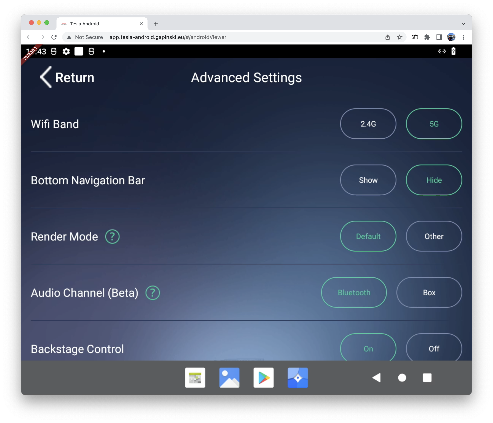

## Install guide (2022.44.2) - Single image method

Version 2022.44.2 is the second release that does not require a secondary Raspberry Pi board running Linux and a first one to drop the capture card requirement.

#### Manual install

If your SD Card is not at least 64GB you can perform a [manual install](/install-guide-full). Please note that smaller cards will not be supported in newer builds that will add support OTA updates.

#### Upgrade from 2022.38.1

If you are currently running version 2022.38.1 you can update by flashing the new Android build onto your primary Raspberry Pi and disconnecting the HDMI capture card.

Make sure to clear the browser data in your car if you experience any problems after updating.

#### Note

This install guide has been updated for version 2022.44.2. Older install guides are available below:
- [Install guide (2022.38.1)](/install-guide-2022-38-1)
- [Install guide (2022.27.1)](/install-guide-2022-27-1)
- [Install guide (2022.25.1)](/install-guide-2022-25-1)
- [Install guide (2022.18.1)](/install-guide-2022-18-1)

### Setup steps

1. Begin by downloading the newest build of Tesla Android from GitHub - [tesla-android-2022.44.2-single-image.img.zip](https://github.com/tesla-android/android-manifest/releases/download/2022.44.2/tesla-android-2022.44.2-single-image.img.zip)
2. Using Raspberry Pi Imager flash an image named: "tesla-android-2022.44.2-single-image.img.zip" to your SD Card. Do not extract the archive, the image is large (this will be reduced in a future update).
3. Grab yourself something to drink, it will take a while.
3. Insert the SD Card into your Raspberry Pi 4 and power it on.
4. Grab yourself something to drink, it will take a while.
5. After booting into Android your Pi will start broadcasting it's own Wi-Fi network. The default password is ``changeit``. You can update it anytime using Android system settings.
6. You did it, you have successfully installed Android 12L on a Raspberry Pi 4!

You've done it. Deploy it in your Tesla, it's ready :) Place the hardware somewhere near the center console, power using USB ports or a external 12V power supply. After connecting your car to the Wi-Fi make sure to check the: "Remain connected in Drive" checkbox in your Tesla. The URL for the Tesla Android frontend is: ``9.9.0.1``.

### Optional steps

#### Audio output

Audio from Android is routed directly to your Tesla Browser.

Playback is allowed even when Drive or Reverse is engaged, meaning that there is no need to pair Tesla Android with your car using Bluetooth(Bluetooth link with the car is only used by your phone for Android Auto or CarPlay).

Audio output from Tesla Browser does not pause media playback from Tesla OS or CarPlay.

Not all apps support audio capture, this restriction will be removed in a feature update.

#### Video streaming

Tesla Android is capable of video streaming, if you want to get smooth playback in a normal resolution I recommended to overclock the Android Pi slightly.

On the boot partition for Android SD card there is a file named config.txt. Add this on the end of it:
```
over_voltage=2
arm_freq=1750
gpu_freq=600
```
Feel free to adjust the preset, this might not be enough if you plan to do some retro console emulation :)

NOTE: Keep in mind that overclocking calls for extra cooling for your Pi. If it starts overheating the performance will be degrated.


#### CarPlay

Tesla Android comes with an app called AutoKit. It enables Apple CarPlay or Android auto using a dongle from Carlinkit (required for both wireless and wired modes). To ensure it works properly apply recommended configuration:
- Set framerate to 30fps or 60fps. Tesla Android uses a 60Hz refresh rate, however 60Hz CarPlay is more power hungry.
- Pick the middle display resolution option if you want the best performance and 3 row CarPlay home screen.
- In Advanced Settings section change Audio Channel(Beta) to Bluetooth (That is very important, this option makes it possible to connect your phone directly to the Car. This enables microphone, steering wheel controls, Siri etc).



If you find your CarPlay jittery at times apply an overclock to your Android Pi. Android on Raspberry Pi 4 lacks support for hardware accelerated video decoding.

Navigation sounds from CarPlay will be routed via Tesla Browser even when Audio Channel is set to Bluetooth in Autokit. This is a problem with the dongle that has been mitigated by Tesla Android in 2022.25.1. If you can't hear navigation sounds make sure to update the AutoKit app.

### Extras

#### Wi-Fi connectivity after install

If you are not able to connect to Wi-Fi after installing Tesla Android:

1. Leave the board powered on for a few minutes(5 or 10) after the first boot (the boot sequence is completed when the Wi-Fi network becomes available)
2. Reboot the board by unplugging the USB-C cable
3. Try again

Please make sure that your Raspberry Pi 4 has current EEPROM(firmware)!

#### Offline mode

Starting with version 2022.27.1 the LTE modem is not required for Tesla Android to maintain connection with your car.<br>
Keep in mind that certain online features might not be available in your car as it expects the Wi-Fi network to replace the connectivity provided by Tesla.<br>
When using the Offline Mode turning off Wi-Fi on your touchscreen or powering off Tesla Android is required for accessing your car with the Tesla Mobile App while parked.<br>
Tesla Android can still be used to provide internet to your car like in previous build - no extra configuration changes are required.
