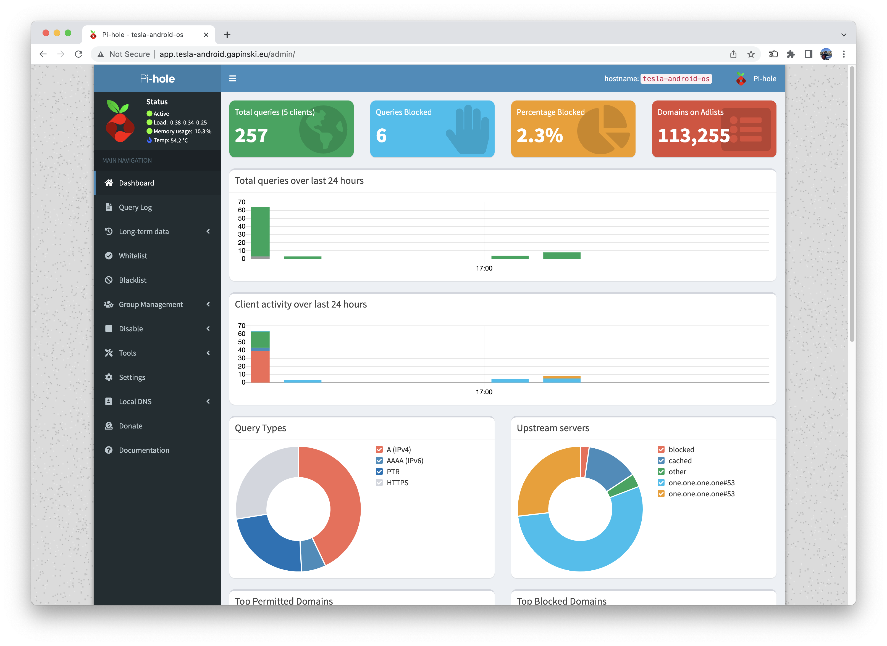
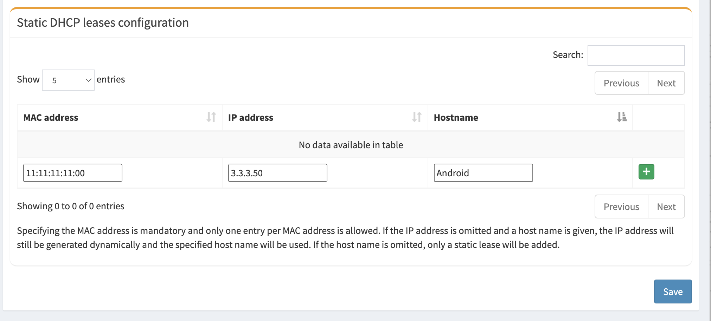
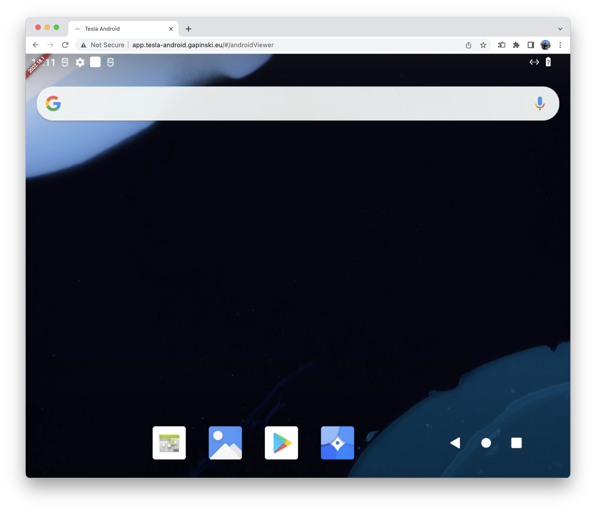

## Install guide (2022.25.1)

In the first few releases two Raspberry Pi boards will be used. This configuration allows easier development and testing of new features. This solution is temporary and will be replaced with a single Raspberry Pi 4 based solution. 

The install guide is divided into two main parts - installing a custom build of Android and exposing it to the Tesla touchscreen using Raspbian (Linux).

#### Note

This install guide has been updated for version 2022.25.1. If you plan on installing version 2022.18.1 please navigate to this page: [Install guide (2022.18.1)](/install-guide-2022-18-1)

### Linux

1. Begin with downloading and unzipping the newest build of Tesla Android OS from GitHub: [tesla-android-os-2022.25.1.zip](https://github.com/tesla-android/tesla-android-os/releases/download/2022.25.1/tesla-android-os-2022.25.1.zip)
2. Using Balena Etcher or Raspberry Pi Imager flash an image named: "tesla-android-os-{version}.img" to your SD Card. Insert the card into your Pi
3. Configure your USB LTE stick using your computer. No other setup then saving your PIN is required. Verify if Internet is accessible after unpluging and pluging your device back into your computer. Then, connect your USB LTE stick to your Pi that will be used for the Linux system.
4. Connect the HDMI capture interface to the camera header on your Pi.
5. Connect the capture interface with a second Pi using an microHDMI to HDMI cable.
6. Using an Ethernet cable connect both your boards together.
7. Plug your Linux Pi to a power source.
8. Wait a few minutes for the Linux Pi to boot up for the first time.
9. Connect your computer to Tesla Android Wi-Fi network. The default password is: "changeit"
10. Using a Terminal of your choice connect to your Linux Pi using SSH:
```
ssh pi@3.3.3.1
```
The password is: "raspberry"
10. Execute the following command on you Linux Pi:
```
sudo nano /etc/hostapd/hostapd.conf
```
11. Navigate to:
```
wpa_passphrase=changeit
```
And update your Wi-Fi password. Make it strong, this network will be available every time your Tesla is awake.
12. Exit and save using Control+X.
13. In your terminal type:
```
sudo reboot
```
To reboot Linux.
14. Connect to Wi-Fi once again with your new password (you might need to forget the network first on your computer, since it will try to use the old password by default) and start a new SSH session, there is one last step needed to finish the setup later on.

### Android

1. Begin by downloading and unzipping the newest build of Tesla Android from GitHub - [tesla-android-2022.15.1.zip](https://github.com/tesla-android/android-manifest/releases/download/2022.25.1/tesla-android-2022.15.1.zip)
2. Make sure that both fastboot and adb is installed and accessible from your terminal. Make sure to use a recent version from [https://developer.android.com/studio/releases/platform-tools](https://developer.android.com/studio/releases/platform-tools) if you stumble upon any issues with flashing.
3. Using Balena Etcher or Raspberry Pi Imager flash an image named: "deploy-sd.img" to your SD Card.
4. Insert the SD Card into your Raspberry Pi 4.
5. Connect the Pi to your computer using a USB-C to USB-A/USB-C cable.
#### Note
Make sure that your computer can power your Raspberry Pi using it's USB ports. USB 3.0 ports are known to work without issues.
6. Verify that your computer has detected the Pi by typing: "fastboot devices". Example of a correct output:

#### Note
If you are using Windows, to make fastboot find your device you need the Android USB Driver, download it from:  [https://developer.android.com/studio/run/win-usb](https://developer.android.com/studio/run/win-usb)
After you plug your Raspberry Pi on your computers USB port, it will be shown as "USB download gadget" on the Windows Device Manager and the command "fastboot devices" won't find anything.
On the Windows Device Manager, right-click the name of the device ("USB download gadget"), and then select Update Driver Software. In the Hardware Update wizard, select Browse my computer for driver software and click Next. Click Browse and then locate the USB driver folder you just downloaded.
Fastboot should be able to find your Raspberry Pi now.
7. Navigate to a folder that contains an extracted archive with Tesla Android.
8. Execute commands one by one to install Android:
    ```bash
    fastboot flash gpt deploy-gpt.img
    fastboot flash bootloader bootloader-sd.img
    fastboot flash uboot-env  env.img
    fastboot reboot
    
    # Wait for board to power up in bootloader

    fastboot oem format
    fastboot flash bootloader      bootloader-sd.img
    fastboot flash uboot-env       env.img
    fastboot flash boot            boot.img
    fastboot flash vendor_boot     vendor_boot.img
    fastboot flash dtbo_a          boot_dtbo.img
    fastboot erase misc
    fastboot reboot-fastboot

    # Wait for board to power up in fastboot

    fastboot flash super  super.img
    fastboot format:ext4 userdata
    fastboot format:ext4 metadata
    fastboot reboot
    ```

9. Grab yourself something to drink, it will take a while.
10. The Pi will reboot a few times before the setup is finished.
11. You did it, you have successfully installed Android 12L on a Raspberry Pi 4!
12. Make sure that both the Android and Linux boards are on. Verify that the Ethernet connection is alive by checking for blinking lights near the ports.
15. When connected to Tesla Android Wi-Fi network on your computer open Chrome and naviate to [http://3.3.3.1/admin/](http://3.3.3.1/admin/) Pi-hole admin panel should load:

There are a lot of cool things you can do here([https://pi-hole.net/](https://pi-hole.net/)), the changes you make here will affect the entire Tesla-Android Wi-Fi network. You can also see DNS queries that your Tesla makes when connected to Wi-Fi if that's something you need. Right now there is only one thing that we need to set here - the static IP address for your Android Pi. You can do it after navigating to the settings menu and selecting the DHCP tab. Under "Static DHCP leases configuration" type in the MAC address of your Android Pi, 3.3.3.50 as an IP address and Android as a hostname:

Remember to save your settings. 
If you don't know the MAC address of your Android Pi, you can check the above section "Currently active DHCP leases" and find your Android IP MAC address there. There should be two addresses listed: your Android Pi and your computer that you connected via Wi-Fi. Or you can find it by going to SSH session at your Linux Pi and use:
```
cat /etc/pihole/dhcp.leases 
```
You should see all clients connected to Your Tesla Android network.
```
1656312591 xx:xx:xx:xx:xx:xx 3.3.3.xxx Android yy:yy:yy:yy:yy:yy 
```
(xx:xx:xx:xx:xx:xx is the MAC address of your Android Pi.)
16. After setting up the IP configuration reboot both your Linux and Android board. Connect to your Tesla-Android Wi-Fi and navigate to [http://3.3.3.1/](http://3.3.3.1/) in Chrome. Swipe down on the Release Notes and play with your new Tesla Android install! It might not work fast on Your computer, however it works very well in your Tesla Browser.


You've done it. Deploy it in your Tesla, it's ready :) Place the hardware somewhere near the center console, power using USB ports or a external 12V power supply.

### Optional steps

#### Audio output

Audio from Android is routed directly to your Tesla Browser.

Playback is allowed even when Drive or Reverse is engaged, meaning that there is no need to pair Tesla Android with your car using Bluetooth(Bluetooth link with the car is only used by your phone for Android Auto or CarPlay).

Audio output from Tesla Browser does not pause media playback from Tesla OS or CarPlay.

In order to active this feature open Audio Capture app on your Tesla Android after installing the OS. It will automatically launch on each boot later. Audio Capture can be terminated using a button present in the status notification.

Not all apps support audio capture, this restriction will be removed in a feature update.

#### Video streaming

Tesla Android is capable of video streaming, if you want to get smooth playback in a normal resolution I recommended to overclock the Android Pi slightly.

On the boot partition for Android SD card there is a file named config.txt. Add this on the end of it:
```
over_voltage=2
arm_freq=1750
gpu_freq=600
```
Feel free to adjust the preset, this might not be enough if you plan to do some retro console emulation :)

NOTE: Keep in mind that overclocking calls for extra cooling for your Pi. If it starts overheating the performance will be degrated.


#### CarPlay

Tesla Android comes with an app called AutoKit. It enables Apple CarPlay or Android auto using a dongle from Carlinkit. To ensure it works properly apply recommended configuration:
- Set framerate to 30fps or 60fps. Tesla Android uses a 60Hz refresh rate, however 60Hz CarPlay is more power hungry.
- In Advanced Settings section change Audio Channel(Beta) to Bluetooth (That is very important, this option makes it possible to connect your phone directly to the Car. This enables microphone, steering wheel controls, Siri etc).


If you find your CarPlay jittery at times apply an overclock to your Android Pi. Android on Raspberry Pi 4 lacks support for hardware accelerated video decoding.

Navigation sounds from CarPlay will be routed via Tesla Browser even when Audio Channel is set to Bluetooth in Autokit. This is a problem with the dongle that has been mitigated by Tesla Android in 2022.25.1. If you can't hear navigation sounds make sure to update the AutoKit app.

### Extras

#### IP address range

For the Flutter app to be accessible in the Tesla Browser I had to use a public IP range. Tesla blocks the IP ranges from [RFC1918](https://tools.ietf.org/html/rfc1918). If that creates any isses for you please provide an alternative IP range [in this discussion](https://github.com/tesla-android/issue-tracker/discussions/4). This issue will be resolved in feature builds.


